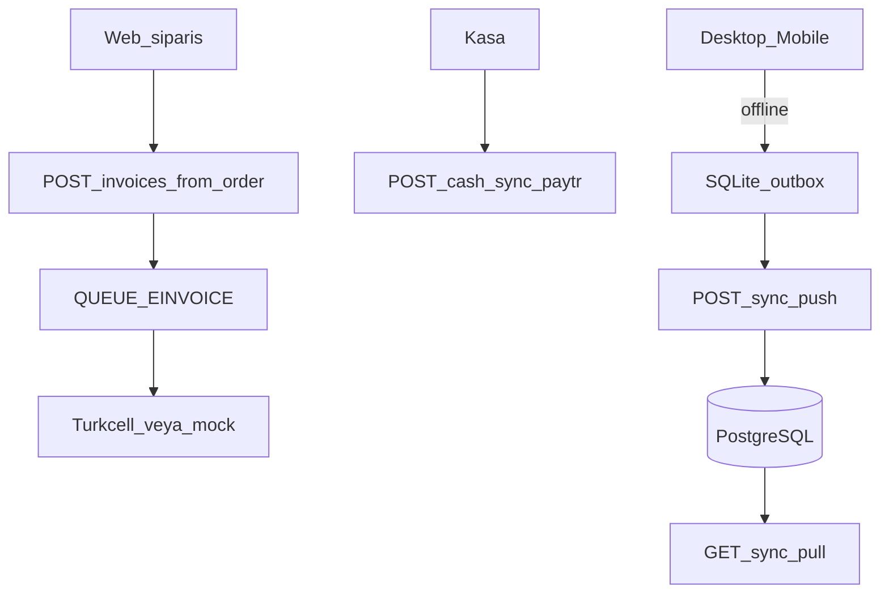

# Ön muhasebe ve e-belge

Masaüstü (`desktop/`, Electron: Windows / macOS / Linux) ve mobil (`mobile/`, Expo) mevcut NestJS API’ye bağlanır. Kaynak gerçekliği PostgreSQL’dir; cihazlar SQLite outbox ile çevrimdışı çalışır.

Tam diyagram: [akislar.md](akislar.md) §8. Masaüstü varsayılan pencere **personel paneli**dir; mağaza menüden açılır. Mobil varsayılan ekran mağazadır; personel `StaffTab`.



## Satış yeterliliği

Türk Kahvesi, Filtre, Espresso, Lokum, Draje, Kuruyemiş, Bitki Çayı, Baharat, Meşrubat ve Çay katalog `kind` + birim (`g`/`kg`/`adet`/`paket`/`lt`) + satır KDV ile satılabilir. Cari, satış/alış fatura, e-arşiv/e-fatura (Turkcell), kasa ve web siparişinden fatura bu ürün karışımı için yeterlidir.

Gıda perakende alanları: barkod, SKT (`expiresAt`), alerjen, içerik; stok `numeric(12,3)`; stok hareketi `waste` (fire); kasa çıkışında gider kategorisi (`kira`, `enerji`, `ambalaj`, `hammadde`, `diger`). Stok raporunda SKT’ye 30 gün kala / geçmiş kalemler işaretlenir.

Bilerek kapsam dışı: yeşil çekirdek → kavrum üretim emri, blend BOM, FEFO lot, yerleşik barkodlu POS, Logo/Paraşüt.

## Roller

`admin`, `staff`, `accountant` — `POST /auth/ops-login`. Müşteri hesapları reddedilir. Staff oluşturma: `POST /auth/ops-users` (yalnızca admin) veya seed `OPS_STAFF_EMAIL` / `OPS_STAFF_PASSWORD`. Detay: [auth.md](auth.md).

## Uçlar

Önek: `/accounting` (Bearer, ops rolleri).

- Cari: `/parties`
- Faturalar: `/invoices` — taslak, kuyruk, gönder, iptal, HTML yazdırma
- Web siparişinden fatura: `POST /invoices/from-order/:orderId` (stok tekrar düşmez)
- Kasa: `/cash/accounts`, `/cash/entries` (`category` isteğe bağlı), `POST /cash/sync-paytr` (PayTR kasa hesabı seed’de oluşur)
- Stok: `/stock`, `/stock/movements` (`waste` dahil; miktar ondalıklı)
- ÖKC: `POST /okc/import` (CSV satırları; e-belge üretilmez)
- Raporlar: `/reports/turnover|vat|cash|stock` (stok satırında `expiresAt`, `expiringSoon`, `expired`)
- Senkron: `POST /sync/push`, `GET /sync/pull?since=`
- e-belge: `/einvoice/taxpayer/:vkn`, `/einvoice/inbox`

e-fatura kuyruk adı: `einvoice` — [kuyruklar.md](kuyruklar.md).

## Turkcell e-Şirket

`TURKCELL_ESIRKET_API_KEY` yoksa mock adapter kullanılır (GİB’e gitmez). Canlı anahtar sonrası `TURKCELL_ESIRKET_MOCK=false`.

## ÖKC

Beko X30TR satışları içeri alınır (fiş no, Z, nakit/kart). Mali fiş kasada kalır; aynı satış için e-arşiv kesilmez.

## Geliştirme

```bash
yarn dev:api
yarn dev:desktop
yarn dev:mobile
```

Paketleme: [desktop/README.md](../desktop/README.md), [mobile/README.md](../mobile/README.md).
