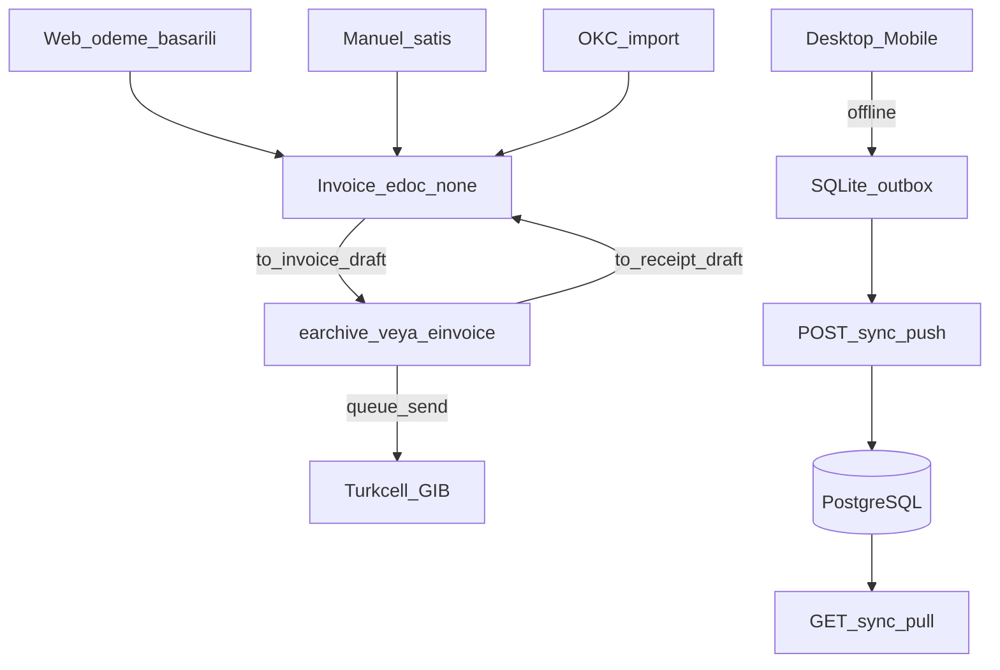

# Ön muhasebe ve e-belge

Masaüstü (`desktop/`, Electron: Windows / macOS / Linux) ve mobil (`mobile/`, Expo) mevcut NestJS API’ye bağlanır. Kaynak gerçekliği PostgreSQL’dir; cihazlar SQLite outbox ile çevrimdışı çalışır.

Tam diyagram: [akislar.md](akislar.md) §8. Masaüstü varsayılan pencere **personel paneli**dir; mağaza menüden açılır. Mobil varsayılan ekran mağazadır; personel `StaffTab`.



## Satış fişi ve fatura

Aynı `Invoice` kaydı iki rolü taşır; **ekranlar ayrıdır** (admin/desktop/mobile):

| Ekran | Filtre | `edocumentType` | UI etiketi | GİB |
|-------|--------|-----------------|------------|-----|
| **Fişler** (`/fisler`) | `receiptOnly=true` | `none` | Fiş | Yok |
| **Faturalar** (`/faturalar`) | `receiptOnly=false` | `earchive` / `einvoice` | e-Arşiv / e-Fatura | Kuyruk / gönder |

- **Otomatik fiş:** web ödeme başarılı → `fromOrder`; manuel fiş oluşturma; ÖKC import → `fromOkcSale` (`okcSaleId` bağlı).
- **Dönüşüm:** `POST /invoices/:id/to-invoice` (yalnızca `draft`) → Faturalar listesine geçer; `POST /invoices/:id/to-receipt` (`draft` / `rejected`) → Fişler listesine geçer. GİB’e gitmiş belge fişe çevrilemez.
- **ÖKC:** iç fiş oluşur; `okcSaleId` dolu belgeler `queue`/`send` edilemez (mali fiş zaten kesildi).
- Numara serisi aynı kalır (`SAT-YYYY-NNNN`); tip değişince numara değişmez.
- HTML yazdırma: fiş başlığı “Satış Fişi”, fatura için e-arşiv/e-fatura.

## Satış yeterliliği

Türk Kahvesi, Filtre, Espresso, Lokum, Draje, Kuruyemiş, Bitki Çayı, Baharat, Meşrubat ve Çay katalog `kind` + birim (`g`/`kg`/`adet`/`paket`/`lt`) + satır KDV ile satılabilir. Cari, satış fişi/fatura, e-arşiv/e-fatura (Turkcell), kasa ve web siparişinden fiş bu ürün karışımı için yeterlidir.

Gıda perakende alanları: barkod, SKT (`expiresAt`), alerjen, içerik; stok `numeric(12,3)`; stok hareketi `waste` (fire); kasa çıkışında gider kategorisi (`kira`, `enerji`, `ambalaj`, `hammadde`, `diger`). Stok raporunda SKT’ye 30 gün kala / geçmiş kalemler işaretlenir.

Bilerek kapsam dışı: yeşil çekirdek → kavrum üretim emri, blend BOM, FEFO lot, yerleşik barkodlu POS, Logo/Paraşüt.

## Roller

`admin`, `staff`, `accountant` — `POST /auth/ops-login`. Müşteri hesapları reddedilir. Staff oluşturma: `POST /auth/ops-users` (yalnızca admin) veya seed `OPS_STAFF_EMAIL` / `OPS_STAFF_PASSWORD`. Detay: [auth.md](auth.md).

## Uçlar

Önek: `/accounting` (Bearer, ops rolleri).

- Cari: `/parties`
- Fişler: UI `/fisler` — `GET /invoices?receiptOnly=true`; oluşturma varsayılan `edocumentType: none`
- Faturalar: UI `/faturalar` — `GET /invoices?receiptOnly=false`; kuyruk, gönder, iptal, HTML yazdırma
- Web siparişinden fiş: `POST /invoices/from-order/:orderId` (ödeme sonrası otomatik; stok tekrar düşmez)
- Dönüşüm: `POST /invoices/:id/to-invoice` (Fişler → Faturalar), `POST /invoices/:id/to-receipt` (Faturalar → Fişler)
- Kasa: `/cash/accounts`, `/cash/entries` (`category` isteğe bağlı), `POST /cash/sync-paytr` (PayTR kasa hesabı seed’de oluşur)
- Stok: `/stock`, `/stock/movements` (`waste` dahil; miktar ondalıklı)
- ÖKC: `POST /okc/import` (CSV; kasa + iç fiş; GİB yok), `GET /okc` (bağlı fiş özeti)
- Raporlar: `/reports/turnover|vat|cash|stock` (stok satırında `expiresAt`, `expiringSoon`, `expired`)
- Senkron: `POST /sync/push`, `GET /sync/pull?since=`
- e-belge: `/einvoice/taxpayer/:vkn`, `/einvoice/inbox`

e-fatura kuyruk adı: `einvoice` — [kuyruklar.md](kuyruklar.md).

## Turkcell e-Şirket

`TURKCELL_ESIRKET_API_KEY` yoksa mock adapter kullanılır (GİB’e gitmez). Canlı anahtar sonrası `TURKCELL_ESIRKET_MOCK=false`.

## ÖKC

Beko X30TR satışları içeri alınır (fiş no, Z, nakit/kart). Mali fiş kasada kalır; iç satış fişi (`edocumentType: none`) oluşur; aynı satış için GİB e-arşiv/e-fatura gönderilmez.

## Geliştirme

```bash
yarn dev:api
yarn dev:desktop
yarn dev:mobile
```

Paketleme: [desktop/README.md](../desktop/README.md), [mobile/README.md](../mobile/README.md).
