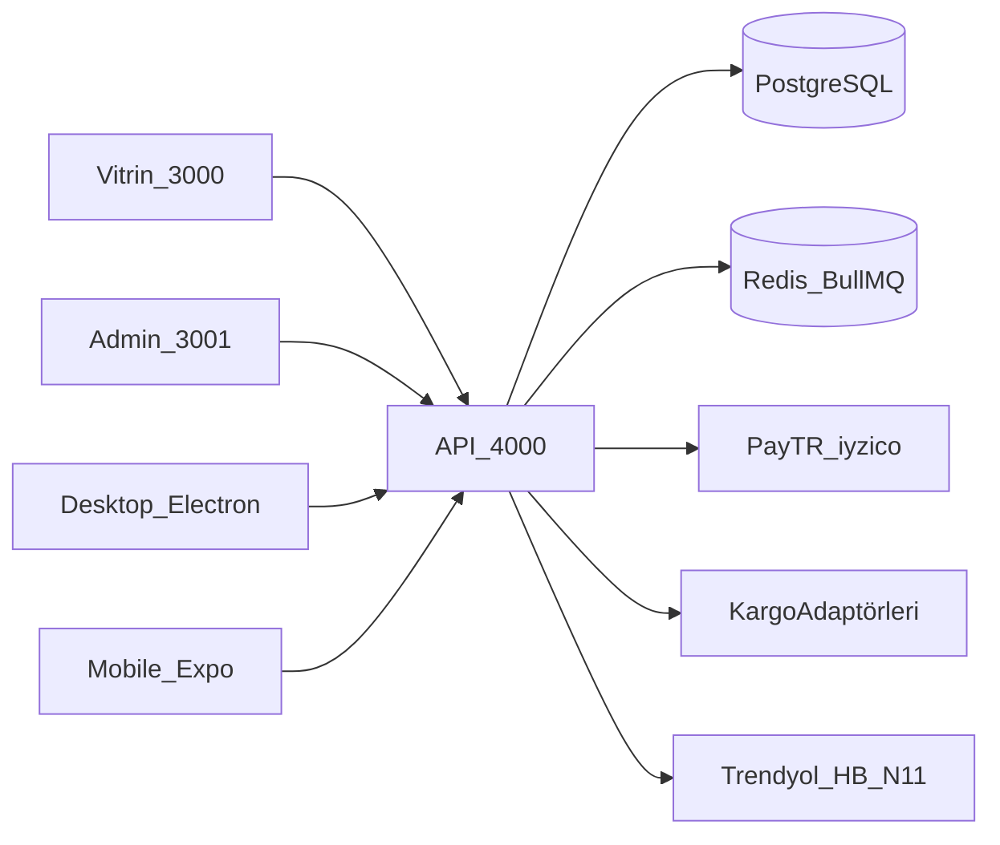
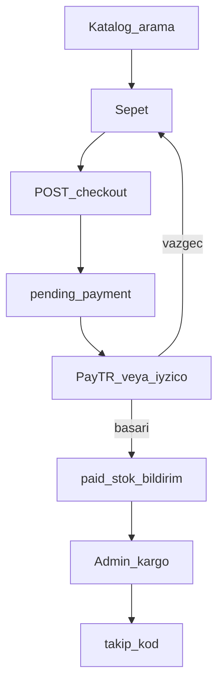
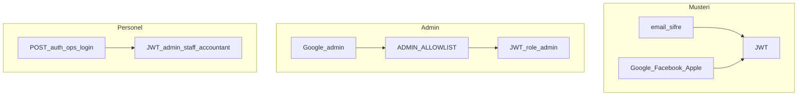
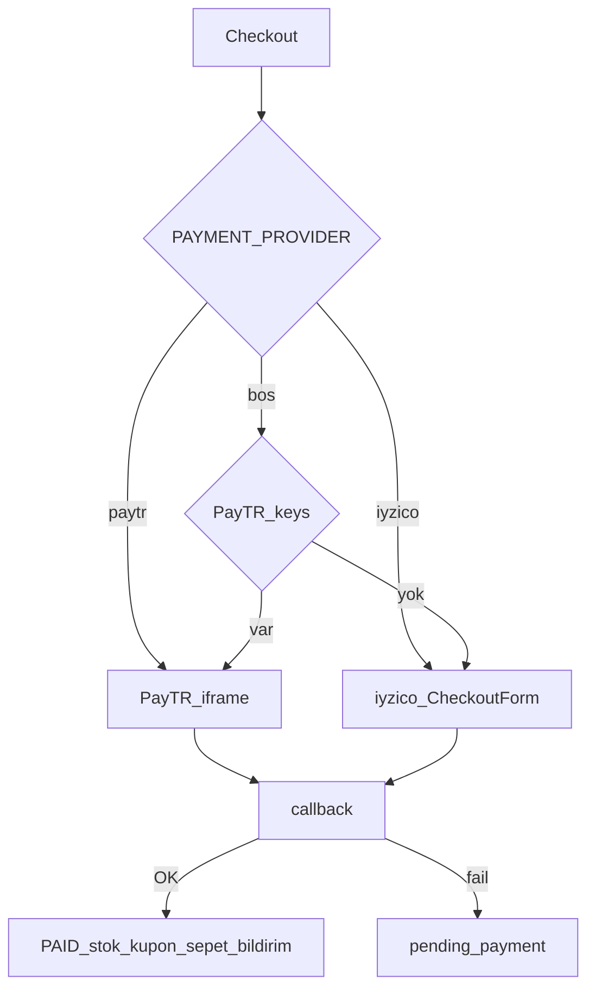
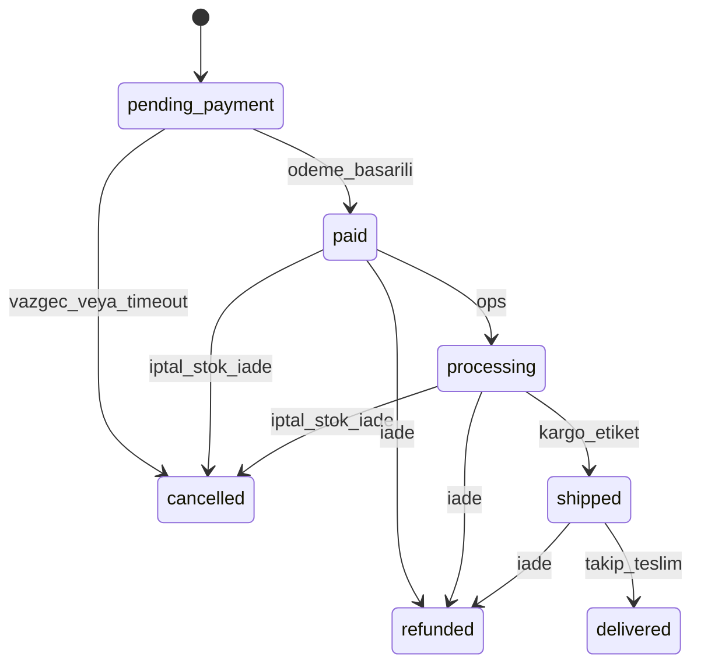
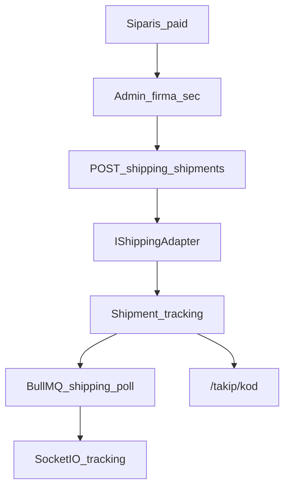
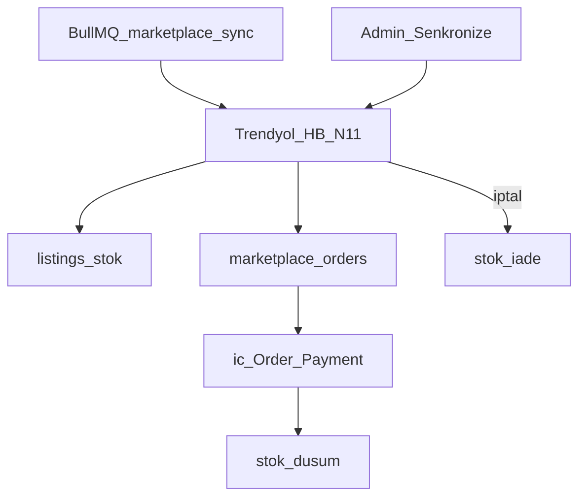
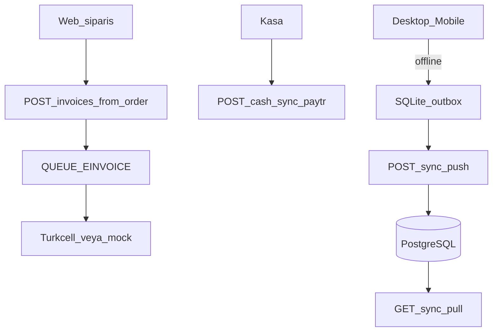
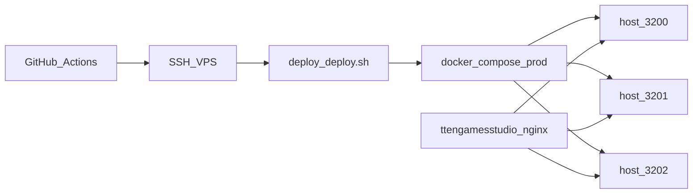

# Akış şemaları

Tek bakışta sistem ve iş akışları. Her diyagramın altında kısa Türkçe özet ve ilgili belge linki vardır. Konu sayfalarında aynı diyagramın kısa hali de bulunur.

Proje tarihçesi: [asamalar.md](asamalar.md).

## 1. Sistem bağlamı

Beş istemci tek NestJS API’ye bağlanır. Kaynak gerçekliği PostgreSQL’dir; kuyruklar Redis/BullMQ üzerindedir. Swagger: `http://localhost:4000/docs`.

İlgili: [architecture.md](architecture.md).

## 2. Müşteri satın alma

Vitrin veya native mağaza: ürün → sepet (`X-Session-Id` veya JWT) → checkout (adres, kupon, yasal onay) → ödeme formu. Başarıda sipariş `paid`, sepet temizlenir, stok düşer. Başarısızlıkta sepet durur.

İlgili: [sepet-odeme.md](sepet-odeme.md), [payments-iyzico.md](payments-iyzico.md).

## 3. Auth

Müşteri vitrin/mobil mağazada e-posta veya OAuth kullanır. Admin panel yalnızca Google + allowlist. Masaüstü ve mobil personel `POST /auth/ops-login` (müşteri hesabı reddedilir).

İlgili: [auth.md](auth.md).

## 4. Ödeme

`GET /payments/provider` aktif sağlayıcıyı döner. Callback public’tir. Mock: anahtar yoksa UI uçtan uca test edilebilir. İade: admin `/iadeler` (PayTR keys varsa sağlayıcı iadesi).

İlgili: [payments-iyzico.md](payments-iyzico.md).

## 5. Sipariş yaşam döngüsü

Stok yalnızca ödeme onayında düşer (`stock_decremented`). `cancelled` / `refunded` stoku geri verir (çift iade yok). Pazaryeri siparişlerinde kargo oluşturma kullanılmaz.

İlgili: [sepet-odeme.md](sepet-odeme.md), [marketplace-adapters.md](marketplace-adapters.md).

## 6. Kargo ve takip

Credentials yoksa mock takip no (production’da `SHIPPING_ALLOW_MOCK` kapalıysa hata). Müşteri vitrinde `/takip/[kod]`; canlı güncelleme WebSocket `/tracking`.

İlgili: [shipping-adapters.md](shipping-adapters.md), [kuyruklar.md](kuyruklar.md).

## 7. Pazaryeri

Otomatik sync `MARKETPLACE_SYNC_*`. Credentials yoksa mock. İç sipariş numarası örneği: `KLC-TY-20260716-0001`. Aktarılmamış kayıt Admin’den **İçe aktar**.

İlgili: [marketplace-adapters.md](marketplace-adapters.md).

## 8. Muhasebe ve e-belge

Kaynak PostgreSQL’dir. Cihazlar SQLite outbox ile çevrimdışı çalışır. Web siparişinden fatura stoku tekrar düşmez. ÖKC CSV mali fiştir; aynı satış için e-arşiv kesilmez.

İlgili: [accounting.md](accounting.md).

## 9. Deploy

Aynı VPS’te TTEN / portfolio ile port çakışması yok. DNS: `@`, `www`, `admin`, `api` → Cloudflare. SSL: `setup-server.sh` (certbot).

İlgili: [deployment-hetzner.md](deployment-hetzner.md), [deploy/README.md](../deploy/README.md).
