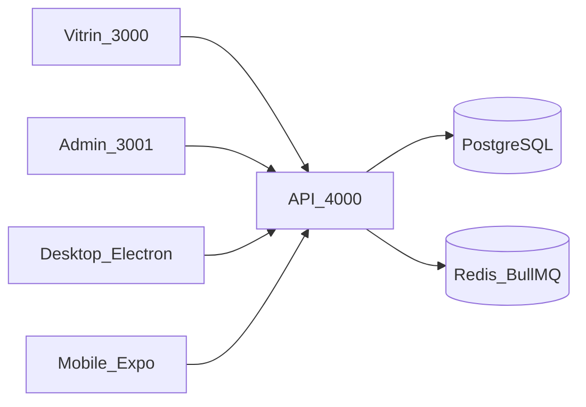

# Mimari

Monorepo, istemciler ve API kuralları. Akış galerisi: [akislar.md](akislar.md). Tarihçe: [asamalar.md](asamalar.md).



## Monorepo

Tek GitHub repository içinde uygulamalar:

| Paket | Klasör | Rol |
|-------|--------|-----|
| `@kilic/api` | `api/` | NestJS REST API |
| `@kilic/frontend` | `frontend/` | Müşteri vitrini (App Router) |
| `@kilic/admin` | `admin/` | Yönetim paneli |
| `@kilic/desktop` | `desktop/` | Electron personel paneli; mağaza menüden açılır |
| `@kilic/mobile` | `mobile/` | Expo native mağaza + personel sekmesi |
| `@kilic/accounting-contracts` | `packages/accounting-contracts` | Ortak DTO/enum |
| `@kilic/ui-tokens` | `packages/ui-tokens` | Admin görsel token’ları |

Yarn workspaces kök `package.json` üzerinden yönetilir. Node ve Yarn sürümleri Volta ile pinlenir.

## Import kuralları

- API: `@entities/*`, `@modules/*`, `@common/*`, `@config/*`, `@database/*`, `@/*`
- Frontend / Admin: `@/*`
- Relative `../` import **kullanılmaz**

## Veri erişimi

TypeORM yalnızca **EntityManager** ile kullanılır:

```ts
constructor(@InjectEntityManager() private readonly em: EntityManager) {}
```

Repository pattern (`@InjectRepository`, custom Repository sınıfları) yasaktır.

## Modüller (API)

`api/src/app.module.ts`:

- `auth` — JWT, e-posta/şifre, Google / Facebook / Apple OAuth; admin Google allowlist; ops-login
- `catalog` — kategori, ürün, varyant, stok, düşük stok tarama
- `cart` — sepet (user veya `X-Session-Id`); abandoned-cart kuyruğu
- `orders` — sipariş yaşam döngüsü + `POST /checkout`
- `payments` — PayTR (varsayılan) + iyzico Checkout Form
- `shipping` — çoklu kargo adaptörleri; poll kuyruğu
- `marketplace` — Trendyol / HB / N11 adaptörleri
- `legal` — sözleşme CMS + çerez onay logu
- `blog` — blog yazıları
- `contact` — iletişim + bülten
- `cms` / `media` / `storage` — site ayarları, içerik bölümleri, yükleme
- `search` — public / admin / ops arama
- `notifications` — e-posta, WhatsApp, inbox, push
- `queues` — BullMQ processor’lar + Bull Board (`/admin/queues`)
- `tracking` — Socket.IO kargo takibi (`/tracking`)
- `addresses` — adres defteri
- `coupons` / `campaigns` — kupon ve flash kampanya
- `reviews` / `wishlist` — yorum ve favori
- `admin` / `customers` — ops istatistik, müşteri CRUD
- `accounting` — cari, fatura, kasa, stok defteri, ÖKC import, senkron, raporlar
- `einvoice` — Turkcell e-Şirket e-arşiv / e-fatura (mock varsayılan)
- `health` — sağlık kontrolü

Gıda perakende alanları ayrı modül değildir: `Product` üzerinde `kind`, `unit`, `vatRate`, `barcode`, `expiresAt`, `allergens`, `ingredients`; stok `numeric(12,3)`; hareket `waste`.

## Kuyruk ve cache

BullMQ Redis’e bağlanır (`REDIS_URL`). Kuyruk listesi: [kuyruklar.md](kuyruklar.md).

## Ortam

Geliştirmede `synchronize: true` (`NODE_ENV !== production` ve `DATABASE_SYNCHRONIZE` boş). Production’da migrations zorunlu; canlıda **deploy one-shot** (`node dist/migrate.js`), API boot’ta `DATABASE_MIGRATIONS_RUN=false`.

## Domain planı (Hetzner)

| Host | Servis |
|------|--------|
| `kiliccoffeeroaster.com.tr` | frontend (host 3200 → container 3000) |
| `admin.kiliccoffeeroaster.com.tr` | admin (host 3201) |
| `api.kiliccoffeeroaster.com.tr` | api (host 3202) |

Mevcut `emrekilic.web.tr` ve `ttengamesstudio.com.tr` host bloklarının yanına eklenir. Detay: [deployment-hetzner.md](deployment-hetzner.md).
