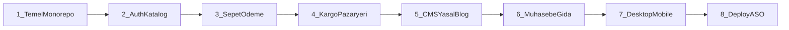

# Proje aşamaları

Bu belge, kod ve migration sırasına göre **ne yaptığımızı** anlatır. Uydurma sprint tarihleri yok; sıra şema evrimi ve paketlerle örtüşür.

Diyagram galerisi: [akislar.md](akislar.md).

## 1. Temel monorepo

Yarn workspaces + Volta pin (`package.json`). Tek repo:

| Paket | Rol |
|-------|-----|
| `@kilic/api` | NestJS REST API, PostgreSQL, TypeORM **EntityManager** |
| `@kilic/frontend` | Next.js müşteri vitrini (port 3000) |
| `@kilic/admin` | Next.js yönetim paneli (port 3001) |

Kurallar: relative `../` import yok; API’de Repository pattern yok (`@InjectEntityManager`). Geliştirmede `synchronize: true`; production’da migration zorunlu.

İlgili: [architecture.md](architecture.md), [setup-local.md](setup-local.md), [database.md](database.md).

## 2. Auth ve katalog

- Müşteri: e-posta/şifre, Google / Facebook / Apple OAuth, JWT Bearer.
- Admin: yalnızca Google OAuth + `ADMIN_ALLOWLIST` / `admin_allowlist` tablosu.
- Katalog: kategori, ürün, varyant, stok.
- Global guard: `JwtAuthGuard` + `RolesGuard`; roller `customer`, `admin`, sonra `staff` / `accountant`.

İlgili: [auth.md](auth.md).

## 3. Sepet ve ödeme

- Sepet: girişli kullanıcı veya `X-Session-Id` misafir sepeti; girişte birleşme.
- Checkout: `POST /checkout` → sipariş `pending_payment`; sepet henüz silinmez.
- Ödeme önce iyzico Checkout Form, sonra **PayTR** varsayılan (`PAYMENT_PROVIDER=paytr`). Anahtar yoksa mock.
- Başarıda fulfillment: `paid`, stok düşümü, kupon onayı, sepet temizleme, bildirim.

İlgili: [sepet-odeme.md](sepet-odeme.md), [payments-iyzico.md](payments-iyzico.md).

## 4. Kargo ve pazaryeri

- 7 kargo adaptörü (`IShippingAdapter`): Yurtiçi, Kolay Gelsin, DHL, Sürat, PTT, HepsiJet, Trendyol Express.
- Admin etiket oluşturur; müşteri `/takip/[kod]`; Socket.IO namespace `/tracking`.
- Pazaryeri: Trendyol, Hepsiburada, N11 — listing, stok, sipariş çekme, iç `Order` import, iptalde stok iadesi.
- Redis + BullMQ: marketplace sync, kargo poll.

İlgili: [shipping-adapters.md](shipping-adapters.md), [marketplace-adapters.md](marketplace-adapters.md), [kuyruklar.md](kuyruklar.md).

## 5. İçerik ve büyüme

Migration izi (özet):

| Migration | Ne eklendi |
|-----------|------------|
| `AddOrderStockDecremented` | `orders.stock_decremented` — çift stok düşümü/iadesi önlemi |
| `NotificationChannelWhatsapp` | WhatsApp bildirim kanalı |
| `PasswordResetAndReturnRequests` | Şifre sıfırlama + iade/cayma talepleri |
| `GuestCartDeliveredAtReminders` | Misafir e-posta, 2. abandoned-cart hatırlatması, `delivered_at` |
| `CampaignsAndRefundAmount` | Kampanya + kısmi iade tutarı |
| `ProductSeoAndHomeFaq` | Ürün SEO, anasayfa SSS CMS |
| `ReplaceUnsplashWithStock` | Stok görselleri (S3) |
| `AboutPageSections` | Hakkımızda CMS bölümleri |
| `InAppNotifications` | Inbox + device push token |
| `CategorySeo` | Kategori `seo_title` / `seo_description` |

Ayrıca: blog, kupon, yorum, favori, legal CMS, çerez onayı, iletişim/bülten, arama.

İlgili: [legal-pages.md](legal-pages.md), [bildirimler.md](bildirimler.md).

## 6. Ön muhasebe ve gıda perakende

- `AccountingAndCatalog`: ürün `kind` / `unit` / `vat_rate`; roller `staff` / `accountant`; cari, fatura, kasa, stok defteri, ÖKC, muhasebe ayarları.
- Turkcell e-Şirket adapter (anahtar yoksa mock).
- `FoodRetailCatalog`: barkod, SKT (`expires_at`), alerjen, içerik; stok `numeric(12,3)`; hareket tipi `waste`; kasa gider kategorisi.

Bilinçli kapsam dışı: yeşil çekirdek üretim emri, blend BOM, FEFO lot, yerleşik barkodlu POS, Logo/Paraşüt.

İlgili: [accounting.md](accounting.md).

## 7. Masaüstü ve mobil istemciler

- **Desktop (Electron):** varsayılan pencere personel paneli; mağaza vitrini menüden. Offline SQLite outbox (`sync/push`, `sync/pull`).
- **Mobile (Expo):** varsayılan native mağaza; personel `StaffTab` (ops JWT). PayTR WebView; push; deep link (App Links).

İlgili: [desktop/README.md](../desktop/README.md), [mobile/README.md](../mobile/README.md), [aso.md](aso.md).

## 8. Yayın

- Hetzner VPS, paylaşımlı nginx; host portlar 3200/3201/3202, Postgres 5434, Redis 6381.
- Domain: `kiliccoffeeroaster.com.tr`, `admin.`, `api.`.
- CI: GitHub Actions → `deploy/deploy.sh`.
- Vitrin `/indir`, Merchant feed, Universal Links / App Links.

İlgili: [deployment-hetzner.md](deployment-hetzner.md), [aso.md](aso.md), [smoke-checklist.md](smoke-checklist.md).
