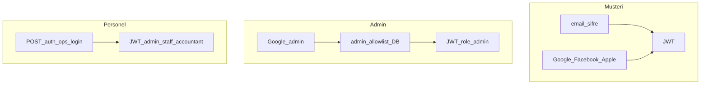

# Kimlik doğrulama

Tam diyagram: [akislar.md](akislar.md) §3.

JWT `Authorization: Bearer <token>` ile gönderilir. Frontend token’ı localStorage’da tutar. Global guard: `JwtAuthGuard` + `RolesGuard`; `@Public()` uçlarda JWT varsa user yine bağlanır.

Roller: `customer`, `admin`, `staff`, `accountant`. `OPS_ROLES` = admin + staff + accountant.

## Müşteri (frontend / mobil mağaza)

Yöntemler:

1. E-posta + şifre — `POST /auth/register`, `POST /auth/login`
2. Google — `GET /auth/google` → callback → JWT. Mobil: `/auth/google?client=mobile`
3. Facebook — `GET /auth/facebook`
4. Apple — web: `GET /auth/apple` (Services ID); iOS native: `POST /auth/apple` (`APPLE_CLIENT_ID` = bundle id)

Hesap silme: `DELETE /auth/me` (yalnızca müşteri). Personel hesapları bu uçtan silinmez.

## Şifre

| Uç | Kim | Not |
|----|-----|-----|
| `POST /auth/forgot-password` | public | Google-only hesap dahil; SMTP yoksa konsol |
| `POST /auth/reset-password` | public | `token` + yeni şifre |
| `POST /auth/change-password` | JWT | Yerel şifreli hesapta mevcut şifre zorunlu |

Vitrin: `/sifremi-unuttum`, `/sifre-sifirla?token=`. Google-only: Hesabım → **Şifre belirle** (mevcut şifre istemez). Mobil deep link: `kilicops://reset-password?token=`.

## Admin

- Google OAuth: `GET /auth/google/admin` (veya ops e-posta + admin rolü)
- Yetki kaynağı: `admin_allowlist` tablosu + `users.role = admin` (Kullanıcılar ekranı)
- `ADMIN_ALLOWLIST` env auth’ta **kullanılmaz**; yalnızca isteğe bağlı seed bootstrap
- Yeni admin: Kullanıcılar → hesap oluştur / allowlist’e e-posta ekle
- Allowlist dışı Google admin girişi reddedilir
- Başarılı allowlist girişinde `role = admin`

## Personel (desktop / mobil StaffTab)

- `POST /auth/ops-login` — e-posta/şifre; `customer` reddedilir.
- Google ops: allowlist rolleri (`admin` / `staff` / `accountant`).
- Staff oluşturma: `POST /auth/ops-users` (yalnızca admin) veya seed `OPS_STAFF_EMAIL` / `OPS_STAFF_PASSWORD`.
- Desktop offline: şifre cache (yalnızca ops).

## Google Cloud Console

1. OAuth 2.0 Client ID (Web) oluşturun
2. Authorized redirect URIs:
   - `http://localhost:4000/auth/google/callback`
   - `http://localhost:4000/auth/google/admin/callback`
   - Production: `https://api.kiliccoffeeroaster.com.tr/auth/google/callback`
   - Production admin: `https://api.kiliccoffeeroaster.com.tr/auth/google/admin/callback`
3. `GOOGLE_CLIENT_ID` / `GOOGLE_CLIENT_SECRET` değerlerini `.env`’e yazın

## Facebook / Apple

İlgili developer konsollarından app kimliklerini alın; anahtarlar boşsa ilgili strategy stub/mock modunda durabilir (API ayağa kalkar, OAuth redirect çalışmaz).
