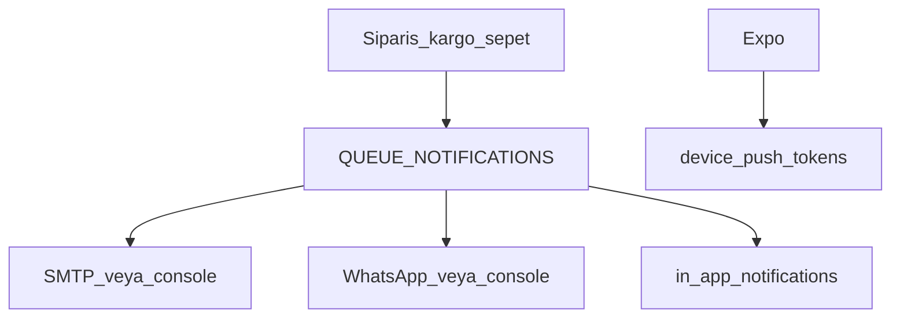

# Bildirimler

Kanallar: e-posta (SMTP), WhatsApp (Meta Cloud API veya console), in-app inbox, cihaz push token. Kuyruk: `notifications` — [kuyruklar.md](kuyruklar.md).

## E-posta

| Değişken | Not |
|----------|-----|
| `MAIL_FROM` | Ör. `Kılıç Coffee Roaster <info@kiliccoffeeroaster.com.tr>` |
| `MAIL_HOST` / `MAIL_PORT` / `MAIL_SECURE` | SMTP |
| `MAIL_USER` / `MAIL_PASS` | Kimlik |

Boş SMTP: mesaj konsola yazılır (şifre sıfırlama linki logda görünür). Şablonlar: sipariş alındı / ödeme / durum, kargo, terk edilen sepet, düşük stok, şifre sıfırlama.

Sipariş admin maili (`ORDER_ALERT_EMAILS`, yoksa `info@` + `ADMIN_ALLOWLIST`): checkout ve ödeme sonrası ürün kalemleri, adres, telefon ve tutarlarla gider. Müşteri mailleri `MAIL_FROM` (info@) üzerinden her aşamada gönderilir.

## WhatsApp

| Değişken | Not |
|----------|-----|
| `WHATSAPP_PROVIDER` | `console` (varsayılan) veya `meta` |
| `WHATSAPP_FROM` | İş hattı E.164 |
| `META_WA_TOKEN` / `META_WA_PHONE_NUMBER_ID` | Cloud API |

Aynı numara WhatsApp Business uygulaması + Cloud API’de birlikte kullanılamaz. Sipariş bildirimleri varsayılan kanallar: `email` + `whatsapp`.

## In-app inbox ve push

Migration `InAppNotifications`: tablolar `in_app_notifications`, `notification_preferences`, `device_push_tokens`.

- Müşteri vitrin: `/hesabim/bildirimler`.
- Mobil: inbox ekranı + FCM (`google-services.json`, `EXPO_PUBLIC_EAS_PROJECT_ID`).
- Tercihler kullanıcı bazında saklanır.

## Şifre sıfırlama

`POST /auth/forgot-password` kuyruğa mail koyar. Web: `/sifre-sifirla?token=`. Mobil: `kilicops://reset-password?token=`.

## Düşük stok

Kuyruk `low-stock`. `LOW_STOCK_THRESHOLD` (varsayılan 10), `LOW_STOCK_ALERT_EMAILS` (boşsa `ADMIN_ALLOWLIST`).

Smoke: [smoke-checklist.md](smoke-checklist.md) §1 (şifre maili), §7 (low-stock).
