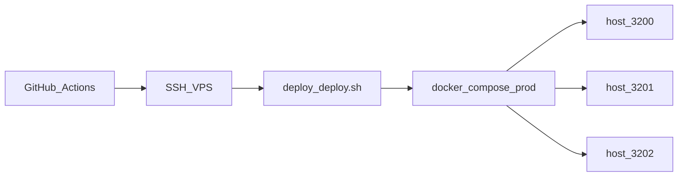

# Hetzner deployment

Bu proje `emrekilic.web.tr` ve `ttengamesstudio.com.tr` ile aynı VPS’e kurulur.
Detaylı adımlar: [`deploy/README.md`](../deploy/README.md)

Akış diyagramı: [akislar.md](akislar.md) §9. Docker özeti: [docker.md](docker.md).



## Özet

| | |
|--|--|
| Dizin | `/opt/kiliccofferoaster` |
| Compose | `docker-compose.prod.yml` (`name: kiliccoffee-prod`) |
| Host portlar | frontend **3200**, admin **3201**, api **3202**, postgres **5434**, redis **6381** |
| Edge | paylaşımlı `ttengamesstudio-nginx` (80/443) |
| CI | `.github/workflows/deploy.yml` → `deploy/deploy.sh` |

```bash
cp deploy/.env.production.example deploy/.env
nano deploy/.env
bash deploy/setup-server.sh
bash deploy/deploy.sh
# yerel dump: bash deploy/migrate-local-to-prod.sh import
```

DNS (Cloudflare Proxied OK): `@`, `www`, `admin`, `api` → VPS IP.

SSL: `deploy/setup-server.sh` (certbot webroot). Cloudflare proxy açıkken HTTP-01 için geçici DNS-only önerilir.

Ödeme callback (PayTR panele): `https://api.kiliccoffeeroaster.com.tr/payments/paytr/callback`.  
OAuth redirect: `https://api.kiliccoffeeroaster.com.tr/auth/google/callback` ve `.../auth/google/admin/callback`.

Güvenlik: `deploy/.env` commit edilmez; JWT/DB şifreleri güçlü olsun; Postgres/Redis yalnızca host localhost bind (erişim localhost).
