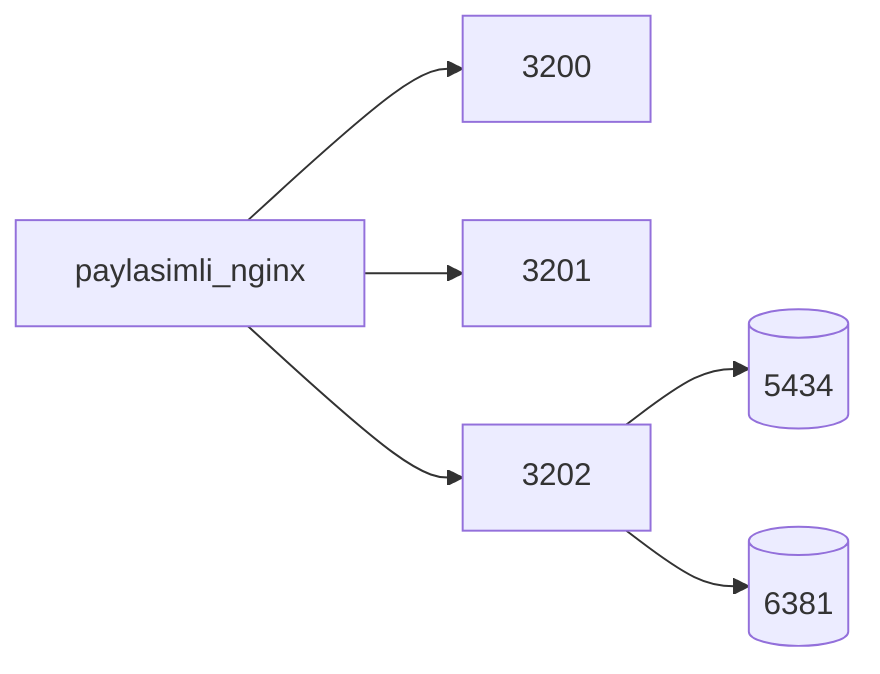

# Docker notları

Yerel geliştirmede Docker Engine yeterlidir (Docker Desktop şart değil). Compose komutları daemon çalışıyorken geçerlidir.

## Yerel (yalnızca veri katmanı)

API/vitrin/admin `yarn dev:*` ile çalışırken Postgres + Redis container yeterlidir:

```bash
docker compose up -d postgres redis
```

Servisler: `postgres:18-alpine` (port `DATABASE_PORT` / 5432), `redis:7-alpine` (port `REDIS_PORT` / 6379).

## Tam stack (yerel Compose)

```bash
docker compose build
docker compose up -d
```

Bu, `api` / `frontend` / `admin` image’larını da ayağa kaldırır (portlar 4000 / 3000 / 3001). Dockerfile’lar: `docker/api.Dockerfile`, `docker/frontend.Dockerfile`, `docker/admin.Dockerfile` (`node:26-bookworm-slim`).

Yarn Berry `--immutable` için kökte `yarn.lock` gerekir (repoda mevcut).

## Production

Asıl runbook: [`deploy/README.md`](../deploy/README.md). Compose: `docker-compose.prod.yml` (`name: kiliccoffee-prod`).

Host portlar (TTEN / portfolio ile çakışmaz): frontend **3200**, admin **3201**, api **3202**, postgres **5434**, redis **6381**. Edge: paylaşımlı `ttengamesstudio-nginx`.


