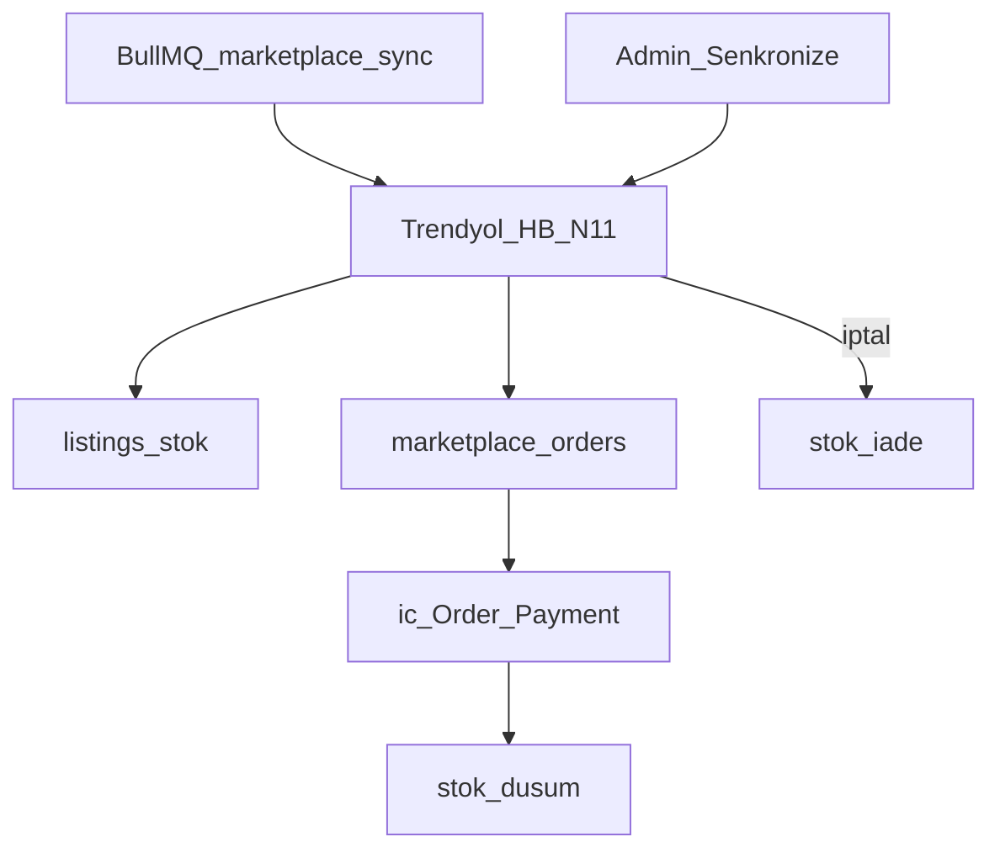

# Pazaryeri adaptörleri

Tam diyagram: [akislar.md](akislar.md) §7.



## Platformlar

| Kod | Platform | Stok | Sipariş | Ürün push |
|-----|----------|------|---------|-----------|
| `trendyol` | Trendyol | Gerçek HTTP | Gerçek HTTP | brandId + categoryId ile |
| `hepsiburada` | Hepsiburada | Gerçek HTTP | Gerçek HTTP | Ürün `hepsiburadaCategoryId` + hesap `brand` |
| `n11` | N11 | Gerçek HTTP | Gerçek HTTP | categoryId + shipmentTemplate ile |

Credentials yoksa işlemler **mock** döner (simülasyon). Credentials varsa gerçek API çağrılır; hata olursa sync `error` durumuna düşer.

## Credential JSON

### Trendyol
```json
{
  "apiKey": "",
  "apiSecret": "",
  "sellerId": "",
  "storeFrontCode": "TR",
  "brandId": "123",
  "categoryId": "456",
  "cargoCompanyId": "10",
  "vatRate": "20"
}
```
- Stok: `externalListingId` = Trendyol **barcode**
- Stage: `TRENDYOL_API_BASE_URL=https://stageapigw.trendyol.com/integration`

### Hepsiburada
```json
{
  "merchantId": "",
  "username": "",
  "password": "",
  "userAgent": "kiliccoffeeroaster_dev",
  "brand": "",
  "barcode": "",
  "cargoCompany": "HepsiJet",
  "attributes": {}
}
```
- `username` = MerchantId, `password` = Secretkey (HB Basic auth).  
- `userAgent` = Developer Username (header).  
- `cargoCompany` = paketlemede varsayılan kargo (HepsiJet önerilir).  
- **Kategori:** her ürünün opsiyonel `hepsiburadaCategoryId` alanı (Admin → Ürünler). Boşsa push **atlanır** (HB’ye gitmez); doluysa o leaf ID ile import edilir.  
- Ürün push: aktif **ProductVariant** satırları ayrı `merchantSku` ile import edilir; aynı ürün `VaryantGroupID` = ürün id. Gramaj + öğütme + kavrum ürün adına yazılır.  
- Kahve varyantları: her satırda `grindOption` / `roastOption` (Admin / Desktop / Mobile ürün formu). Ürün `allow*` bayrakları hangi seçeneklerin açılabileceğini belirler.  
- Leaf kategori + zorunlu attributeler developer portalden; ortak alanlar `attributes` ile eklenebilir.  
- Stok: her listing kendi varyant stokunu sync eder (`externalSku` = varyant SKU).  
- Test (SIT): `HEPSIBURADA_MPOP_BASE_URL=https://mpop-sit.hepsiburada.com`, `HEPSIBURADA_LISTING_BASE_URL=https://listing-external-sit.hepsiburada.com`, `HEPSIBURADA_OMS_BASE_URL=https://oms-external-sit.hepsiburada.com`.

### N11
```json
{
  "appKey": "",
  "appSecret": "",
  "categoryId": "",
  "shipmentTemplate": "",
  "preparingDay": "3"
}
```
Stok: `stockCode` = `externalSku` / `externalListingId`.

## Sync

Admin “Senkronize” ve otomatik Bull job (`MARKETPLACE_SYNC_*`) aynı adaptörleri kullanır. Kuyruk adı: `marketplace-sync` — [kuyruklar.md](kuyruklar.md).

| Env | Açıklama |
|-----|----------|
| `MARKETPLACE_SYNC_ENABLED` | Otomatik sync (default true) |
| `MARKETPLACE_SYNC_INTERVAL_MINUTES` | Aralık (min 5) |
| `TRENDYOL_API_BASE_URL` | Trendyol gateway |
| `HEPSIBURADA_MPOP_BASE_URL` | Katalog (MPOP) |
| `HEPSIBURADA_LISTING_BASE_URL` | Listing / stok API |
| `HEPSIBURADA_OMS_BASE_URL` | Sipariş / paket OMS |
| `HEPSIBURADA_USER_AGENT` | Varsayılan User-Agent (Developer Username) |
| `HEPSIBURADA_WEBHOOK_SECRET` | Opsiyonel webhook doğrulama |
| `N11_API_BASE_URL` | N11 API host |
| `N11_INTEGRATOR_NAME` | N11 integrator etiketi |

## Hepsiburada kargo / fulfillment

Çift yönlü durum akışı:

| Yön | Ne olur |
|-----|---------|
| Sync (poll) | Sipariş + paket listeleri (`packaged` / `shipped` / `delivered`) birleştirilir → iç `Order` durumu güncellenir |
| Admin “kargoya verildi” | Bağlı HB siparişte `POST .../packages` (createPackages); `cargoCompany` varsayılan HepsiJet |
| HB webhook | `PUT {API}/marketplace/webhooks/hepsiburada/packages/{packageNumber}/{intransit\|deliver\|undeliver}` → iç sipariş `shipped` / `delivered` |

Developer portalde merchant webhook base URL:

`https://<api-host>/marketplace/webhooks/hepsiburada`

Secret kullanıyorsanız URL’ye `?secret=...` ekleyin veya HB’nin header geçmesine izin verin (`x-webhook-secret`).

**Not:** HepsiJet ile kargoda takip numarası HB tarafında oluşur; müşteri takibi asıl HB siparişlerinde. Bizdeki `/takip` marketplace import’ta `userId: null` olduğu için otomatik dolmaz.

## Canlıya alma

1. Satıcı panellerinden API anahtarlarını alın  
2. Admin `/pazaryeri` → hesap + `is_enabled`  
3. Mevcut listings için barcode/SKU eşlemesi  
4. Dry-run sync → gerçek sync  
5. Siparişlerin `marketplace_orders` tablosuna düştüğünü kontrol edin  
6. HB webhook base URL’ini kaydedin; SIT’te paket/teslim olayını doğrulayın  

## İç sipariş import

Sipariş sync sırasında (credentials ile veya mock):

1. `marketplace_orders` kaydı oluşturulur/güncellenir  
2. `MarketplaceOrderImportService` otomatik olarak iç `Order` + `OrderItem` + `Payment` oluşturur  
3. `internal_order_id` bağlanır; ürün eşlemesi listing `externalListingId` / SKU / barcode üzerinden yapılır  
4. Aktif siparişlerde yerel stok düşülür (`orders.stock_decremented = true`)  
5. Pazaryeri iptal/iade sync’inde veya admin durum `cancelled` / `refunded` yapınca stok iade edilir (bayrak false)  

Mevcut aktif siparişler için (kolon eklendikten sonra bir kez):

```sql
UPDATE orders SET stock_decremented = true
WHERE status IN ('paid','processing','shipped','delivered');
```

Production: migration `AddOrderStockDecremented` bunu da yapar.

Sipariş numarası örneği: `KLC-TY-20260716-0001` (TY / HB / N11).

Otomatik import başarısız olduysa veya sipariş bağlı değilse Admin `/pazaryeri` → Detay:

- Tek sipariş: `POST /marketplace/orders/:id/import` (UI: **İçe aktar** / **Durum güncelle**)
- Hesaptaki bekleyenler: `POST /marketplace/accounts/:id/import-orders` (UI: **Bekleyen siparişleri aktar**)

Zaten bağlı siparişte yeniden çağrı yalnızca durumu senkronlar; kopya iç sipariş üretmez. Pazaryeri siparişinde “kargo oluştur” gizlenir.
