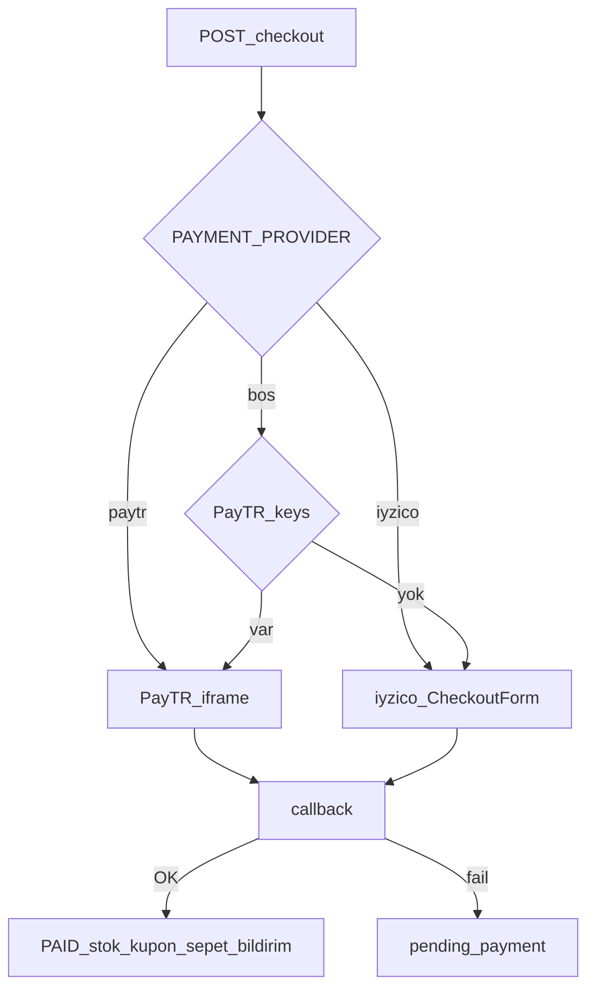

# Ödeme (PayTR / iyzico)

Abonelik yoktur; sepet üzerinden tek seferlik ödeme. Checkout bağlamı: [sepet-odeme.md](sepet-odeme.md). Tam diyagram: [akislar.md](akislar.md) §4.

Dosya adı tarihsel olarak `payments-iyzico.md`; aktif varsayılan sağlayıcı **PayTR**.



## Sağlayıcı seçimi

`GET /payments/provider` aktif adı döner.

1. `PAYMENT_PROVIDER=paytr` veya `iyzico` açıkça set ise o kullanılır.
2. Boşsa: PayTR merchant bilgileri doluysa PayTR, değilse iyzico.

Vitrin ve **mobil native (iOS/Android)** aynı kanalı kullanır: PayTR → güvenli ödeme URL / WebView; iyzico → checkout URL veya form HTML. Fiziksel ürün satışı olduğu için App Store / Play IAP kullanılmaz (Apple 3.1.3(e) / Google fiziksel mal politikası).

## Eski: RevenueCat (kullanılmıyor)

Mobil checkout artık PayTR/iyzico’ya gider. RevenueCat endpoint’leri ve env değişkenleri geçmiş siparişler / raporlama için kodda kalabilir; **yeni mağaza siparişleri IAP ile oluşturulmaz.** Dijital abonelik eklenirse bu bölüm yeniden değerlendirilir.

```
REVENUECAT_SECRET_API_KEY=
REVENUECAT_WEBHOOK_AUTH_KEY=
REVENUECAT_SHIPPING_PRODUCT_ID=
REVENUECAT_PRODUCT_MAP=250:kilic_checkout_250,500:kilic_checkout_500
EXPO_PUBLIC_REVENUECAT_IOS_KEY=
EXPO_PUBLIC_REVENUECAT_ANDROID_KEY=
```

Webhook URL (legacy): `{API_URL}/payments/revenuecat/webhook`

Eski akış (referans):

1. `POST /checkout` + mobil header → `revenuecat` + `purchaseItems`
2. `react-native-purchases` satın alma
3. `POST /payments/revenuecat/confirm` / webhook

Tutar kademesi üreticisi (legacy): `yarn workspace @kilic/api iap:tiers`

### RevenueCat panelinde yapılacaklar (yalnızca IAP yeniden açılırsa)

1. Proje oluştur → iOS + Android uygulama ekle (`tr.kiliccoffeeroaster.ops`)
2. **Project settings → API keys:** Secret API Key → `REVENUECAT_SECRET_API_KEY`
3. **Apps:** Public SDK keys → `EXPO_PUBLIC_REVENUECAT_IOS_KEY` / `ANDROID_KEY`
4. **Products:** Store IAP id’lerini import / sync
5. **Integrations → Webhooks:** URL `https://api.kiliccoffeeroaster.com.tr/payments/revenuecat/webhook`

## PayTR

```
PAYMENT_PROVIDER=paytr
PAYTR_MERCHANT_ID=
PAYTR_MERCHANT_KEY=
PAYTR_MERCHANT_SALT=
PAYTR_TEST_MODE=1
PAYTR_DEBUG_ON=1
```

Bildirim URL (PayTR panele yazın): `{API_URL}/payments/paytr/callback`  
Canlı: `https://api.kiliccoffeeroaster.com.tr/payments/paytr/callback`

## iyzico (yedek)

```
IYZICO_API_KEY=
IYZICO_SECRET_KEY=
IYZICO_BASE_URL=https://sandbox-api.iyzipay.com
```

Production base URL: `https://api.iyzipay.com`

## Akış

1. Checkout’ta sipariş oluşturulur (`pending_payment`); sepet silinmez.
2. `POST /payments/initialize` veya checkout yanıtındaki token / iframe.
3. Kullanıcı ödeme sayfası / form.
4. Callback: PayTR `POST /payments/paytr/callback`; iyzico `GET|POST /payments/callback`.
5. Başarı: `Payment.status = success`, `Order.status = paid`, stok düşümü, kupon onayı, sepet temizleme, bildirim.
6. Başarısız / vazgeç: sepet durur, stok düşmez. `POST /payments/retry` ile yeniden denenebilir.

## Mock

API anahtarları boşsa servis **mock token** döner; uçtan uca UI test edilir. Canlıya almadan önce sandbox (PayTR test mode / iyzico sandbox) ile doğrulayın.

## İade

Admin `/iadeler`: onay/red, kısmi tutar. PayTR keys varsa sağlayıcı iadesi. Sipariş `refunded` / `cancelled` → stok iadesi (`stock_decremented`).

## Endpoint’ler

- `GET /payments/provider` — aktif sağlayıcı
- `POST /payments/initialize` — sipariş için ödeme başlat
- `POST /payments/retry` — yeniden dene
- `GET|POST /payments/callback` — iyzico dönüşü (public)
- `POST /payments/paytr/callback` — PayTR bildirim (public)
- `POST /payments/revenuecat/confirm` — legacy IAP (public)
- `POST /payments/revenuecat/webhook` — legacy IAP webhook (public)

Detaylı alanlar Swagger `/docs` altında. Muhasebe kasa: `POST /accounting/cash/sync-paytr`.
