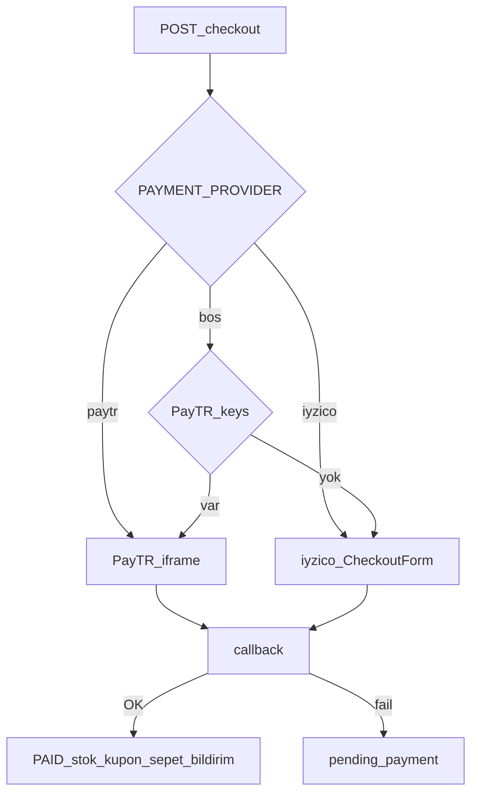

# Ödeme (PayTR / iyzico)

Abonelik yoktur; sepet üzerinden tek seferlik ödeme. Checkout bağlamı: [sepet-odeme.md](sepet-odeme.md). Tam diyagram: [akislar.md](akislar.md) §4.

Dosya adı tarihsel olarak `payments-iyzico.md`; aktif varsayılan sağlayıcı **PayTR**.



## Sağlayıcı seçimi

`GET /payments/provider` aktif adı döner.

1. `PAYMENT_PROVIDER=paytr` veya `iyzico` açıkça set ise o kullanılır.
2. Boşsa: PayTR merchant bilgileri doluysa PayTR, değilse iyzico.

Vitrin: PayTR → `/odeme/paytr` (iframe). iyzico → checkout URL veya form HTML. **Mobil native (iOS/Android): RevenueCat** — App Store / Google Play in-app purchase; `X-Client-Platform` header’ı ile checkout PayTR yerine RevenueCat döner.

## RevenueCat (mobil)

Web vitrin ve desktop **PayTR** kalır. Expo native mağaza uygulaması checkout’ta `X-Client-Platform: ios|android` gönderir; API siparişi `revenuecat` provider ile oluşturur, satın alma App Store / Play üzerinden yapılır.

```
REVENUECAT_SECRET_API_KEY=
REVENUECAT_WEBHOOK_AUTH_KEY=
REVENUECAT_SHIPPING_PRODUCT_ID=
REVENUECAT_PRODUCT_MAP=250:kilic_checkout_250,500:kilic_checkout_500
EXPO_PUBLIC_REVENUECAT_IOS_KEY=
EXPO_PUBLIC_REVENUECAT_ANDROID_KEY=
```

Webhook URL: `{API_URL}/payments/revenuecat/webhook`

Akış:

1. `POST /checkout` (mobil header) → sipariş + `purchaseItems` (varyant SKU = store product id).
2. Mobil `react-native-purchases` ile satın alma; `Purchases.logIn(orderId)`.
3. `POST /payments/revenuecat/confirm` — istemci doğrulama (secret key yoksa mock).
4. Webhook — yedek fulfillment (`INITIAL_PURCHASE`, `NON_RENEWING_PURCHASE`).

Mobilde kupon henüz desteklenmez. Kargo ücreti varsa `REVENUECAT_SHIPPING_PRODUCT_ID` gerekir (yalnızca varyant-SKU modunda; **tutar kademesi modunda kargo sipariş totaline dahil**, ayrı ürün gerekmez).

### Toplu ürün — Google/Meta feed gibi değil

RevenueCat **mağaza ürünlerini oluşturmaz**; App Store Connect ve Google Play Console’daki IAP kayıtlarını yönetir. Google Merchant / Meta feed XML’i reklam kataloğu içindir, IAP ile ilgisi yoktur.

**Önerilen yol (çok ürünlü katalog):** Her varyant için ayrı IAP yerine **tutar kademeleri** (`REVENUECAT_PRODUCT_MAP`). Örn. 50₺ aralıklarla `kilic_checkout_250`, `kilic_checkout_300` … — sipariş totaline (kargo dahil) uygun kademe seçilir.

Listeyi üretmek için:

```bash
yarn workspace @kilic/api iap:tiers
# veya: node api/scripts/generate-revenuecat-iap-tiers.mjs --max 3000 --step 50
```

Çıktıdaki product id’leri **hem** Play Console **hem** App Store Connect’te consumable olarak oluşturun, sonra RevenueCat → Products’a import edin.

**Kargo (89,90₺):** Tutar kademesi kullanıyorsanız kargo zaten `order.total` içinde; ayrı `shipping_product_id` **gerekmez**. Varyant-SKU modunda tek ürün: Play/App Store’da `kilic_shipping_8990` · **89,90 TRY** · consumable → `REVENUECAT_SHIPPING_PRODUCT_ID=kilic_shipping_8990`.

### RevenueCat panelinde yapılacaklar

1. Proje oluştur → iOS + Android uygulama ekle (`tr.kiliccoffeeroaster.ops`)
2. **Project settings → API keys:** Secret API Key → `REVENUECAT_SECRET_API_KEY`
3. **Apps:** Public SDK keys → `EXPO_PUBLIC_REVENUECAT_IOS_KEY` / `ANDROID_KEY`
4. **Products:** Store’da oluşturduğunuz IAP id’lerini import / sync
5. **Entitlements (opsiyonel):** Tek entitlement `shop` → tüm checkout ürünlerini bağlayın
6. **Integrations → Webhooks:** URL `https://api.kiliccoffeeroaster.com.tr/payments/revenuecat/webhook`, Authorization → `REVENUECAT_WEBHOOK_AUTH_KEY`

## PayTR

```
PAYMENT_PROVIDER=paytr
PAYTR_MERCHANT_ID=
PAYTR_MERCHANT_KEY=
PAYTR_MERCHANT_SALT=
PAYTR_TEST_MODE=1
PAYTR_DEBUG_ON=1
```

Bildirim URL (PayTR panele yazın): `{API_URL}/payments/paytr/callback`  
Canlı: `https://api.kiliccoffeeroaster.com.tr/payments/paytr/callback`

## iyzico (yedek)

```
IYZICO_API_KEY=
IYZICO_SECRET_KEY=
IYZICO_BASE_URL=https://sandbox-api.iyzipay.com
```

Production base URL: `https://api.iyzipay.com`

## Akış

1. Checkout’ta sipariş oluşturulur (`pending_payment`); sepet silinmez.
2. `POST /payments/initialize` veya checkout yanıtındaki token / iframe.
3. Kullanıcı ödeme sayfası / form.
4. Callback: PayTR `POST /payments/paytr/callback`; iyzico `GET|POST /payments/callback`.
5. Başarı: `Payment.status = success`, `Order.status = paid`, stok düşümü, kupon onayı, sepet temizleme, bildirim.
6. Başarısız / vazgeç: sepet durur, stok düşmez. `POST /payments/retry` ile yeniden denenebilir.

## Mock

API anahtarları boşsa servis **mock token** döner; uçtan uca UI test edilir. Canlıya almadan önce sandbox (PayTR test mode / iyzico sandbox) ile doğrulayın.

## İade

Admin `/iadeler`: onay/red, kısmi tutar. PayTR keys varsa sağlayıcı iadesi. Sipariş `refunded` / `cancelled` → stok iadesi (`stock_decremented`).

## Endpoint’ler

- `GET /payments/provider` — aktif sağlayıcı
- `POST /payments/initialize` — sipariş için ödeme başlat
- `POST /payments/retry` — yeniden dene
- `GET|POST /payments/callback` — iyzico dönüşü (public)
- `POST /payments/paytr/callback` — PayTR bildirim (public)
- `POST /payments/revenuecat/confirm` — mobil satın alma doğrulama (public)
- `POST /payments/revenuecat/webhook` — RevenueCat webhook (public)

Detaylı alanlar Swagger `/docs` altında. Muhasebe kasa: `POST /accounting/cash/sync-paytr`.
