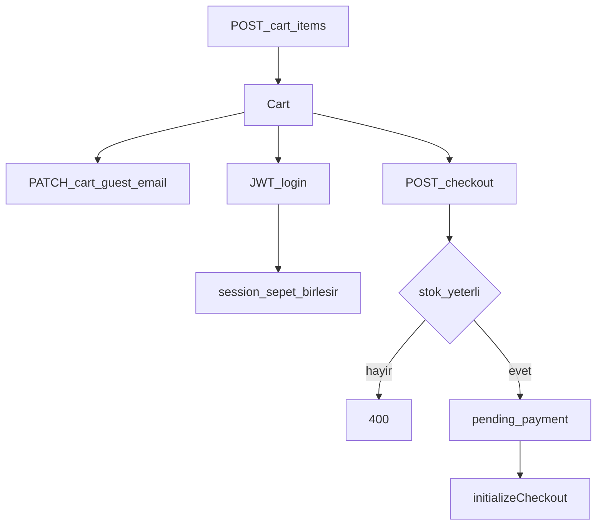

# Sepet ve checkout

Misafir ve girişli alışveriş aynı `cart` uçlarını kullanır. Ödeme detayı: [payments-iyzico.md](payments-iyzico.md). Genel diyagram: [akislar.md](akislar.md).

## Kimlik

- Girişli: JWT `Authorization: Bearer`.
- Misafir: header `X-Session-Id` (vitrin/mobil session id üretir ve saklar).
- Giriş sonrası session sepeti kullanıcı sepetine birleşir; kalemler silinmez, miktarlar toplanır.

## Uçlar (`/cart`, public + opsiyonel JWT)

| Method | Yol | Not |
|--------|-----|-----|
| GET | `/cart` | Sepeti getir |
| POST | `/cart/items` | Ürün / varyant ekle |
| PATCH | `/cart/items/:itemId` | Miktar güncelle |
| DELETE | `/cart/items/:itemId` | Kalem sil |
| PATCH | `/cart/guest-email` | Terk edilen sepet maili için e-posta |

## Checkout

`POST /checkout` (aynı session/JWT):

1. `OrdersService.createFromCart` — yasal onaylar (`legal_acceptances`), kupon, adres, kargo ücreti.
2. Yetersiz stokta sipariş oluşmaz (anlamlı hata).
3. Sipariş `pending_payment`; **sepet henüz silinmez**.
4. `PaymentsService.initializeCheckout` — aktif sağlayıcı PayTR veya iyzico.
5. Yanıt: `orderId`, `orderNumber`, `provider`, `iframeUrl` / `paymentPageUrl` / `checkoutFormContent`, `mock`.

Vitrin: `/odeme` → PayTR için `/odeme/paytr`. Mobil: `CheckoutScreen` → `PaytrScreen`.

## Terk edilen sepet

BullMQ kuyruk `abandoned-cart` ([kuyruklar.md](kuyruklar.md)):

| Env | Varsayılan | Anlam |
|-----|------------|--------|
| `ABANDONED_CART_HOURS` | 4 | 1. hatırlatma |
| `ABANDONED_CART_SECOND_HOURS` | 24 | 1. den sonra 2. hatırlatma |

Hedef: girişli kullanıcının e-postası veya misafir `guest-email`. SMTP yoksa konsola yazılır.

## Stok

- Checkout anında kilitleme / yetersiz stok reddi.
- Stok **ödeme başarısında** düşer (`orders.stock_decremented = true`).
- `cancelled` / `refunded` stoku geri verir (çift iade yok).

Smoke maddeleri: [smoke-checklist.md](smoke-checklist.md) §3.
