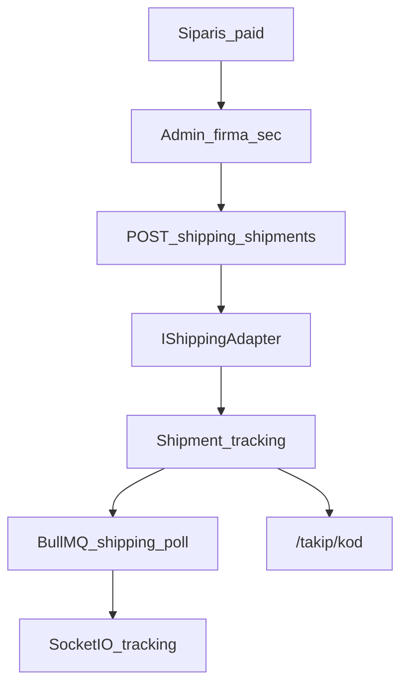

# Kargo adaptörleri

Tam diyagram: [akislar.md](akislar.md) §6.

## Desteklenen firmalar

| Kod | Firma |
|-----|--------|
| `yurtici` | Yurtiçi Kargo |
| `kolay_gelsin` | Kolay Gelsin |
| `dhl` | DHL |
| `surat` | Sürat Kargo |
| `ptt` | PTT Kargo |
| `hepsijet` | HepsiJet |
| `trendyol_express` | Trendyol Express |

## Mimari

Her sağlayıcı `IShippingAdapter` arayüzünü uygular:

- `createShipment(order, credentials)`
- `trackShipment(trackingNumber, credentials)`

Admin panelinden `/kargo` sayfasında credentials JSON ve `is_enabled` yönetilir (`shipping_provider_configs` tablosu). PATCH’te provider kodu ile UUID karışmasın (smoke §9).

## Mock mod

Credentials boş veya provider kapalıysa adaptör sahte takip numarası üretir. Production’da `SHIPPING_ALLOW_MOCK` varsayılan kapalıdır; credentials yokken etiket oluşturmak hata verir.

## Sipariş akışı

1. Ödeme başarılı (`paid`)
2. Admin sipariş detayında kargo firması seçer
3. `POST /shipping/shipments` etiket / tracking üretir; sipariş `shipped`
4. BullMQ `shipping-poll` takip durumunu çeker; teslimde sipariş `delivered`
5. Müşteri `/takip/[kod]`; canlı: Socket.IO namespace `/tracking`
6. Pazaryeri kaynaklı siparişte “kargo oluştur” kullanılmaz (platform kendi kargosunu yönetir)

Public: açık sağlayıcı listesi + takip sorgusu. Ops: `OPS_ROLES`.
